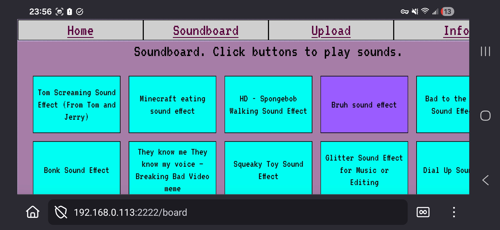
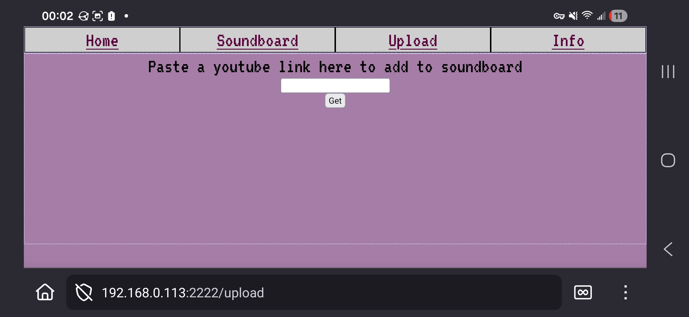

# Web-Soundboard

Half-template from an old project, half-vibecoded app made for a collaborative soundboard to use on my laptop projecting a movie in my living room. 






```
python ./app/app.py
```

secret pages:
- `/downloadall`
- `/logs`